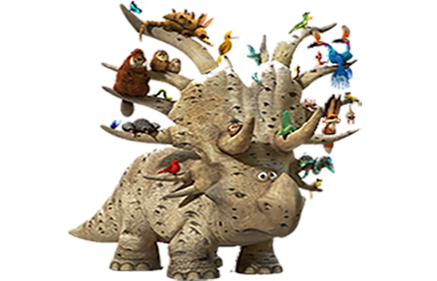
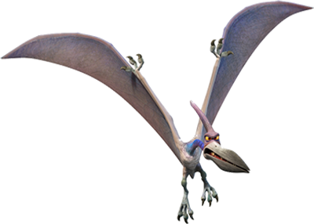
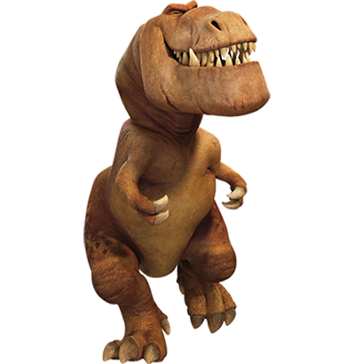
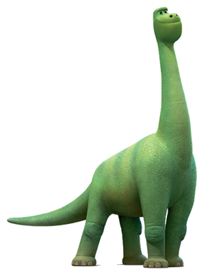

# FUNKY DINO FIGHT

Here is the [Funky DINO FIGHT](https://thomasmelchers.github.io/js-rpg/) Game !

Funky Dino Fight is a RPG that I imagine to improve my JavaScript technical skills. 
I wasn't interested in a RPG where Humans, Orcs, Vampires, ... are figthing each other. So I decide to create something new and a dino figth comes quickly to my mind. 

The game is still inspire from the original [instructions](https://github.com/becodeorg/BXL-Swartz-5.34/tree/main/1.The-Field/12.Javascript/rpg-project) with some modifications. 

## GAMEPLAY

So how does the game works. 
At the moment, you launch on a select menu where you can chose a dino which will be your dino character for the fight. You have to name your dino and select a special attack for the fight. The opponent will be picked up randomly like its name and its attack. 

When you click on the button you will be launch into a wild arena where both dinos face each other. 
On the top of the screen, you can read all the details about your dino and your opponent's dino (name, life remaining, the dino species, the attack selected).

There you will have two actions : hit your opponent or heal yourself. 

At the bottom of the screen, there is a screen where all the actions made are logged. 

## DINO CHARACTERS

You can chose into four different dinos : 
- Triceratops ;
- Pterodactile : 
- T-rex ; 
- Diplodocus. 

Of course every dino will have its own stats ! All theses stats and dino informations are written into an object. So its easier to find all the data when you need to create the gameplay and all the actions. 

### TRICERATOPS 

| Health | Charge Attack | Tail Attack | Bite Attack | Claws Attack | Dodge an Attack |
| ------ | ------------- | ----------- | ----------- | ------------ | --------------- |
| 100 | 60 | 35 | 10 | 30 | 30 |

### PTERODACTILE 

| Health | Charge Attack | Tail Attack | Bite Attack | Claws Attack | Dodge an Attack |
| ------ | ------------- | ----------- | ----------- | ------------ | --------------- |
| 90 | 10 | 10 | 40 | 40 | 80 |

### T-REX

| Health | Charge Attack | Tail Attack | Bite Attack | Claws Attack | Dodge an Attack |
| ------ | ------------- | ----------- | ----------- | ------------ | --------------- |
| 120 | 40 | 30 | 60 | 40 | 20 |

### DIPLODOCUS

| Health | Charge Attack | Tail Attack | Bite Attack | Claws Attack | Dodge an Attack |
| ------ | ------------- | ----------- | ----------- | ------------ | --------------- |
| 150 | 40 | 50 | 10 | 20 | 10 |

## DINO'S ACTIONS

Each dino got two actions : 
- Hit ;
- Heal.

### HIT

When a dino hit its opponent, the damages inflicted are the damages of the attack selected. However, the opponent got some skills to dodge an attack ! If you flight you got more chance to dodge one. 
So the first thing does the function is to know if the dino will hit its opponent or if the opponent would dodge the attack. If the dino which attacks succeed, he will damage its opponent. 

### HEAL 

The "heal" action is just an action which regenerate the health to the dino. But the health will never go over its maximum ! 

## HOW TO IMPROVE TO THE GAME 
- Make it more responsive ;
- Select some images which are opensources ;
- Find a way to select both dino characters ; 
- Add a popup which shows which dino character has won the fight ;
- Add some animation/movement when a dino fight ; 
- Put some animation to show which dino has to fight ; 
- Find a way to use the third button, maybe a popup which displays some info about the dino. 